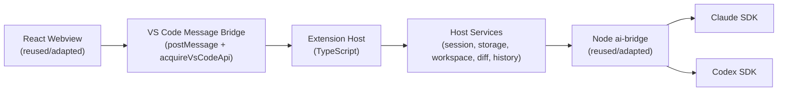

# VS Code Parity Migration Design

**Date:** 2026-04-02  
**Status:** Approved for planning and execution  
**Source Product:** `/Users/zhukunpeng/Desktop/idea-claude-code-gui`

## Goal

Recreate the IDEA plugin's non-JetBrains-specific product experience as a VS Code extension,
keeping the same single-sidebar UI and interaction model first, then optimizing the VS Code
experience only after functional parity is working.

## Context

The source implementation is already split into three practical layers:

1. A JetBrains host layer in Java that owns tool window lifecycle, actions, settings, PSI-backed
   context collection, diff windows, and permission dialogs.
2. A React webview in TypeScript that already contains most visible UI, state orchestration, and
   frontend interaction logic.
3. A Node-based `ai-bridge` that normalizes Claude and Codex SDK behavior behind a shared protocol.

The target repository currently contains only a Spec Kit scaffold. That makes this migration a host
rebuild, not a direct line-by-line port.

## Design Decisions

### 1. Compatibility-First Migration

The first VS Code release MUST preserve the approved single-sidebar information architecture and
high-level interaction flow. We intentionally avoid redesigning tabs, settings surfaces, or message
flow before the product is runnable.

### 2. Rebuild The Host, Reuse The UI And Bridge

The VS Code extension host replaces the IDEA Java/JCEF layer. The React webview and Node
`ai-bridge` are the primary reuse targets. This keeps the migration focused on API adaptation
instead of product reinvention.

### 3. Keep A Stable Frontend Event Contract

The existing webview talks to IDEA through a string-based bridge in
`/Users/zhukunpeng/Desktop/idea-claude-code-gui/webview/src/utils/bridge.ts`. The VS Code port
should keep a near-compatible message vocabulary and move the transport to
`webview.postMessage` plus `acquireVsCodeApi()`.

### 4. Treat IDE-Specific Features As Explicit Exclusions

JetBrains-only capabilities such as PSI-specific context extraction, Swing/JCEF lifecycle behavior,
status bar widgets, and Run Configuration integrations are out of parity scope unless a clearly
equivalent VS Code API exists.

### 5. Deliver Parity In Phases

The migration proceeds in three phases:

1. Run the same shell, provider switching, and streaming chat.
2. Restore session fidelity, workspace context, and settings/history flows.
3. Add safety flows and advanced orchestration such as permissions, diff review, MCP, and agents.

## Target Architecture



## Module Breakdown

### Extension Host

The extension host is the new adapter layer. It owns the parts previously implemented by IDEA
services and handlers.

Recommended structure:

```text
src/
├── extension.ts
├── webview/
│   ├── host/
│   │   ├── panelManager.ts
│   │   ├── webviewHtml.ts
│   │   └── messageBridge.ts
│   ├── handlers/
│   │   ├── sessionHandler.ts
│   │   ├── settingsHandler.ts
│   │   ├── fileHandler.ts
│   │   ├── historyHandler.ts
│   │   ├── diffHandler.ts
│   │   └── permissionHandler.ts
│   ├── services/
│   │   ├── aiBridgeService.ts
│   │   ├── workspaceContextService.ts
│   │   ├── storageService.ts
│   │   ├── providerConfigService.ts
│   │   └── tabSessionService.ts
│   └── types/
│       ├── bridge.ts
│       └── session.ts
└── test/
```

Responsibilities:

- `panelManager.ts`: register the sidebar view, restore it, and keep a single stable panel host.
- `messageBridge.ts`: parse frontend events and dispatch to typed handlers.
- `sessionHandler.ts`: send messages, interrupt runs, restart sessions, and stream output.
- `settingsHandler.ts`: persist provider, model, permission mode, send shortcut, and feature flags.
- `fileHandler.ts`: open files, open URLs, and list workspace files.
- `historyHandler.ts`: load provider history, favorites, exports, and custom session metadata.
- `diffHandler.ts`: phase-2/3 adapter for VS Code diff and review commands.
- `permissionHandler.ts`: phase-3 approval routing for tools and plan dialogs.

### Webview

The VS Code webview should start by importing the current `webview/` app from the IDEA project and
only changing the bridge and asset-loading assumptions needed for VS Code.

What should stay stable first:

- the root `App.tsx` orchestration model
- the single-sidebar chat/history/settings structure
- provider switching UI
- tab/session UX inside the panel
- message rendering, markdown, tools, and dialog flows

What should change first:

- `sendToJava` and `window.*` callbacks
- static asset URL resolution for VS Code webviews
- startup bootstrapping and initial state hydration

### AI Bridge

The `ai-bridge` remains the provider normalization layer:

- keep `channel-manager.js` as the main entrypoint
- keep provider-specific channel modules
- keep shared permission and model mapping behavior
- move only the host invocation logic from Java `ProcessBuilder` to Node child process handling in
  the VS Code extension host

## Phase Plan

### Phase 1: Shell And Streaming

Objective: make the extension runnable with the same sidebar shell and basic chat flows.

Included:

- VS Code extension manifest and sidebar registration
- webview bundle loading in VS Code
- message bridge compatibility layer
- Claude and Codex provider switching
- send message, stream response, stop/restart session
- per-tab in-memory state

Exit criteria:

- user can open the sidebar
- user can switch between Claude and Codex
- user can send a message and receive streaming output
- the UI remains recognizably the same as the IDEA product

### Phase 2: Workspace And Session Fidelity

Objective: make the product feel like the same tool during normal daily use.

Included:

- working directory handling
- file open and browser open flows
- workspace file listing and current editor context
- tab persistence and session metadata storage
- history loading, favorites, export, and custom titles
- provider settings persistence

Exit criteria:

- reopening VS Code restores expected panel state
- history and settings survive reloads
- file references and context actions behave predictably

### Phase 3: Safety And Advanced Orchestration

Objective: restore the more specialized product flows that depend on host orchestration.

Included:

- permission approval and question dialogs
- diff preview and editable diff workflows
- slash commands and prompt loading
- MCP server support
- agents and subagents
- parity polishing for non-IDEA-specific flows

Exit criteria:

- advanced flows behave with the same intent as the IDEA product
- all remaining non-JetBrains-specific gaps are either closed or explicitly documented

## Parity Matrix

| Capability | Target | Phase | VS Code Notes |
| --- | --- | --- | --- |
| Single sidebar chat/history/settings UI | Preserve | 1 | Reuse existing React structure inside one `WebviewViewProvider` |
| Claude/Codex provider switching | Preserve | 1 | Keep shared provider state and `ai-bridge` protocol |
| Streaming chat responses | Preserve | 1 | Translate bridge callbacks to `webview.postMessage` |
| Internal multi-tab session UX | Preserve | 1-2 | Store metadata in extension storage and frontend state |
| Working directory and file context | Preserve | 2 | Map to VS Code workspace/editor APIs |
| History, favorites, export, custom titles | Preserve | 2 | Reuse metadata model; replace IDEA storage glue |
| Provider settings and model config | Preserve | 2 | Use `workspaceState` or `globalState` as appropriate |
| Permission approval dialogs | Preserve intent | 3 | Use VS Code webview/dialog commands instead of Swing dialogs |
| Diff review and editable diff | Preserve intent | 3 | Use VS Code diff editors and custom commands |
| Slash commands and MCP | Preserve | 3 | Keep existing prompt and bridge logic where possible |
| Agent/subagent UI | Preserve | 3 | Reuse frontend UX; re-implement host routing |
| PSI-enhanced language context | Exclude | N/A | No direct parity target in first migration |
| IDEA status bar widget | Exclude | N/A | No equivalent required for first migration |
| Run configuration monitoring | Exclude | N/A | Revisit only if there is clear VS Code demand |

## Acceptance Criteria

The migration is successful when all of the following are true:

1. The extension opens a single sidebar panel that matches the current product's major screens and
   flow.
2. Phase 1 can run real Claude and Codex chat sessions through the reused `ai-bridge`.
3. Phase 2 restores session, history, and workspace behaviors without introducing a redesigned UX.
4. Phase 3 either ships or explicitly documents every remaining non-IDEA-specific parity gap.
5. Each phase ends with automated tests and a manual smoke checklist before the next phase starts.

## Risks And Mitigations

### Risk: The Existing Webview Assumes IDEA-Specific Callbacks

Mitigation: keep the event names stable and replace the transport, not the UI state model.

### Risk: VS Code Webview Asset Rules Differ From JCEF

Mitigation: centralize asset URI generation in `webviewHtml.ts` and avoid hard-coded paths in the
frontend.

### Risk: Session, History, And Settings Become Split Across Too Many Stores

Mitigation: define one typed storage service up front and route host persistence through it.

### Risk: Permission And Diff Flows Block Early Progress

Mitigation: keep them out of Phase 1 while reserving dedicated host handler boundaries for Phase 3.

## Verification Strategy

Each phase MUST include:

- host unit tests for new TypeScript services and message handlers
- webview tests for bridge adaptation and state-sensitive UI logic
- a manual smoke run in VS Code with both providers
- a parity checklist that marks preserved behavior, adapted behavior, and excluded behavior

## Recommended Next Artifact

Use this design as the source for the implementation plan, then execute the migration in phase
order without redesigning the UI until parity is demonstrably working.
